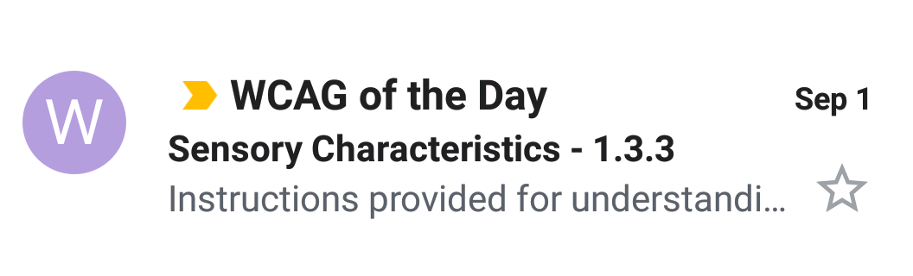

# WCAG of the Day

## What is this?

Just like those "Word of the Day" email services you can subscribe to, this will send you a daily email with distilled info on a random [Web Content Accessibility Guidelines](https://www.w3.org/WAI/standards-guidelines/wcag/) (WCAG) success criterion.

![A screenshot of the main content of this email in Gmail on Android. "Adaptable" is the principle shown at the top, followed by "Sensory Characteristics (Level A)" as the success criterion name and level, followed by the success criterion's text and the guideline's text, which starts "On accessible websites... Instructions provided for understanding and operating content do not solely rely on sensory characteristics of components such as shape, color, size, visual location, orientation, or sound." The example included at the end of the email is cutoff at the bottom of the screenshot.](images/mobileEmailContent.png)

You can also preview this email in your browser by following [this link](https://htmlpreview.github.io/?https://raw.githubusercontent.com/Grunet/digestible-wcag-sc-emails/master/dist/1-3-3.html) (to preview the other emails, change the last 3 digits in the URL to match those of the success criterion you're interested in).

## Why was it made?

I found (and still find) WCAG kind of hard to read and understand, and as a result I avoided trying to read it for myself.

This service was made to help keep me engaged in trying to understand the criteria directly, one at a time, and make them a little easier to grok too.

## How do I sign up?

## How can I give feedback?

You've got a few options:

- Reply to one of the daily emails
- [Tweet at or message me on Twitter](https://twitter.com/__grunet)
- [Chat or message me on Reddit](https://www.reddit.com/user/__grunet)
- [Write up an issue on Github](https://github.com/Grunet/digestible-wcag)
